<div align="center">


# StarPie Touch

### Lightweight, Fast & Configurable Radial Pie Menu for Windows 10 / 11

[](https://github.com/oohb144/StarPie-Touch/releases)
[-0078D4.svg?style=flat-square&logo=windows)](https://microsoft.com/windows)
[](https://dotnet.microsoft.com/)
[](LICENSE)
[](tests/)
[](#i18n)
[](#acknowledgements)

<br/>

**[简体中文](README.md)** • **[English](README_EN.md)**

<br/>

[🌟 Highlights](#highlights) • [🚀 Quick Start](#download) • [✨ Features](#features) • [🎨 Visual Customization](#visuals) • [🌐 i18n](#i18n) • [🛠️ Build & Development](#build) • [💡 Story & Maintenance](#acknowledgements) • [📋 Changelog](CHANGELOG.md)

</div>

---

## <a id="intro"></a>📖 Introduction

> **Origin:** This is an independently maintained derivative of the [original StarPie project (Star-Pie/StarPie)](https://github.com/Star-Pie/StarPie), with touch changes maintained by `oohb144`. It is not an official upstream release. The original [MIT license](LICENSE) and attribution are retained. This version comes from a local source snapshot from September 2026 and does not include every later upstream change.

### What this touch edition adds

- **Global two-finger wheel:** hold two fingers for about 150 ms and slide them together in an ordinary desktop app. Existing sectors and nested actions remain available.
- **Pen guard:** pen hover or contact suppresses the touch trigger; the existing fullscreen exclusion still applies.
- **Lighter touch rendering:** touch uses a native software layered window by default, while mouse input keeps the WPF wheel. The measured working set after a nested action was 81.3 MB on one device; this is not a guarantee for other devices or configurations.
- **Faster action dispatch after release:** touch skips modifier-key cleanup intended for mouse and keyboard input. In a device retest, wheel dismissal took 1.5–6.2 ms and the user reported a faster response.

The touch wheel currently uses simplified dark sectors and action labels. It does not yet reproduce custom icons, styles, or animations from the WPF wheel. `--wpf-touch-wheel` restores the previous touch renderer for a run; `--disable-touch` disables touch recognition. Official action plugins still come from the original project's plugin repository and require manual installation.

**StarPie** is a lightweight radial mouse gesture (Radial / Pie Menu) productivity tool built exclusively for Windows 10 / 11.

In daily use or professional 3D modeling software, you can summon the radial wheel with the **right / middle / side mouse buttons or a keyboard trigger key**, or execute actions directly with independent trail gestures. The current version supports 4 / 8 / 12 sector wheels, multi-level sub-actions, per-application profiles (Per-App Profiles), window management & tiling, on-screen OCR, hotkey recording, URL & command dispatching, and comprehensive visual customization — turning high-frequency operations into natural muscle memory.

> 💡 **Design Highlights**:
> - **Low Resource Usage**: Built on native C# WPF with no bundled browser engine; the background-resident process targets a lightweight footprint of roughly **3 – 8 MB** in typical idle scenarios;
> - **Low Latency Response**: Built on the Win32 `WH_MOUSE_LL` low-level event stream for instant response, without affecting normal right-click behavior;
> - **Portable & Green**: Ships as a standalone single-file build (with the .NET runtime embedded — just unzip and run); configuration is stored locally in `config.json`;

<details open>
<summary><b>🎬 Demo Video / Video Demo</b></summary>
<br/>

<div align="center">
  <a href="https://www.bilibili.com/video/BV1XjtA6KEGL" target="_blank">
    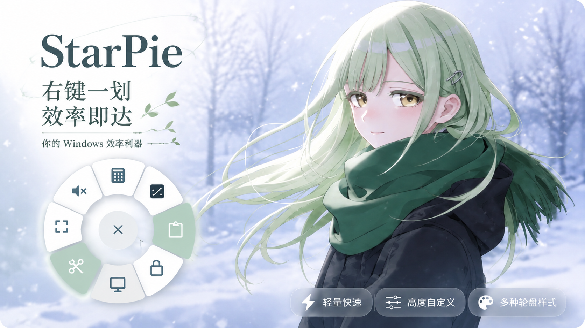
  </a>
  <p>
    <a href="https://www.bilibili.com/video/BV1XjtA6KEGL"><b>📺 Click to watch the narrated walkthrough &amp; live demo on Bilibili</b></a>
  </p>
</div>

</details>

---

## <a id="highlights"></a>🌟 v1.6.8 Highlights

Building on the original radial menu, StarPie `v1.6.8` further integrates **trail gestures, window management, on-screen OCR, multi-profile configuration, and in-depth visual customization**, while keeping lightweight, low latency, and muscle memory as its core design directions.

| Area | Current Capabilities |
| :--- | :--- |
| **Wheel Interaction** | 4 / 8 / 12 sectors, center-core actions, multi-level sub-wheels, honeycomb fans & outer-escape cancel |
| **Trail Gestures** | Up to 3 segments, 8-direction combinations, trail overlay, per-segment sensitivity & release hints |
| **Actions & Windows** | Hotkeys, apps, URLs, folders, commands, system controls, plus window switching, tiling, cross-monitor moves, always-on-top & transparency |
| **Screen OCR** | Local offline Windows recognition, AI vision APIs & custom HTTP OCR |
| **Configuration UX** | Two-pane focused editing, live wheel canvas, sector drag-to-swap, running-window capture & compact overview list |
| **Visual Customization** | Multiple wheel shapes, independent level-1 / level-2 themes, per-sector font / icon / text-position overrides & screen-edge overflow protection |

> 📋 For the complete version history, see [CHANGELOG.md](CHANGELOG.md).

---

## <a id="features"></a>✨ Features

### 1. ⚡ Quick Gesture Summon & Action Trigger

- Hold and drag the right mouse button past the configured threshold to summon the wheel; slide onto a target sector and release to trigger its action (hotkey, app launch, folder, or system function);
- A normal right-click still opens the native context menu — the two never conflict;
- Supports right / middle / side buttons, single keyboard keys, and modifier combos as trigger keys, with either drag-past-threshold or long-press-delay summoning;
- While recording hotkeys, the app can temporarily take exclusive control and pause global hotkeys, preventing system combos like `Win + D` or `Alt + Tab` from firing accidentally.

<div align="center">
  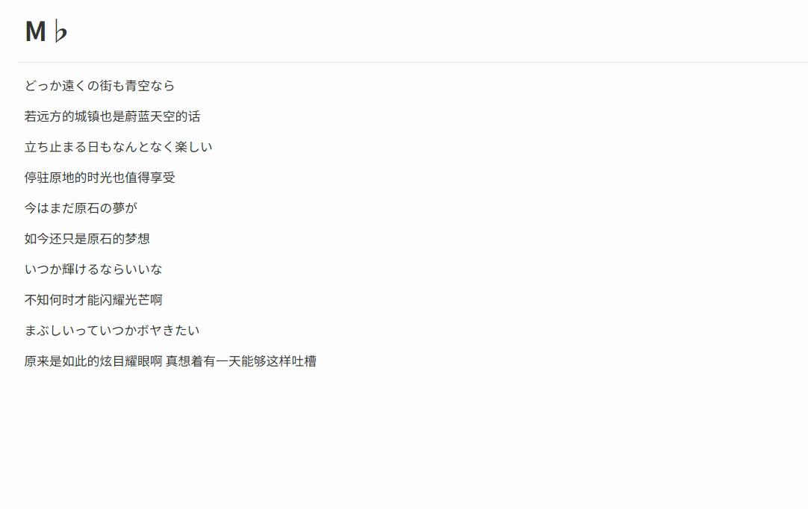
  <br/><br/>
  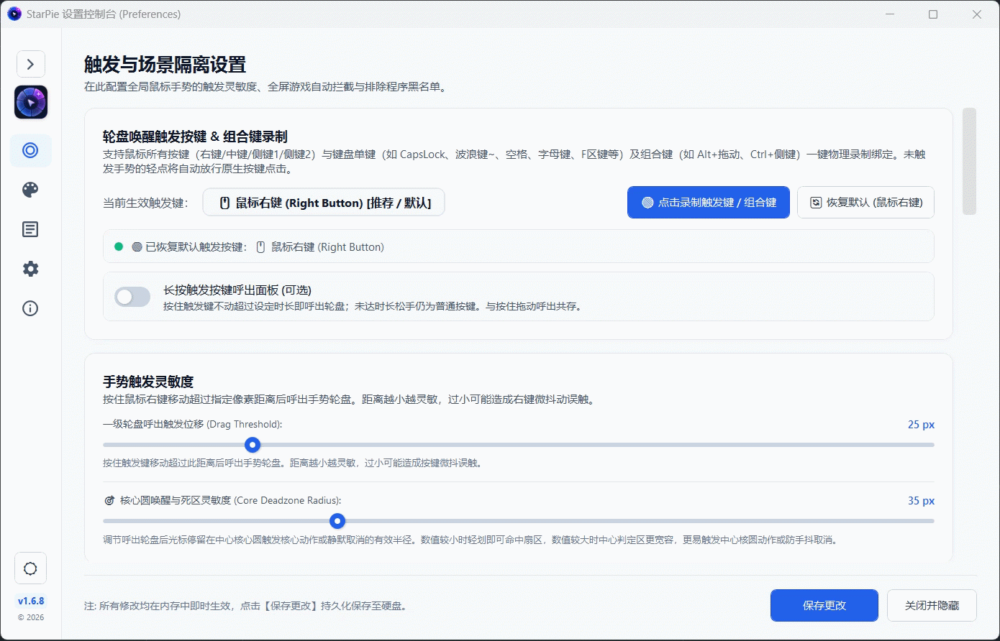
</div>

---

### 2. 🌟 Multi-Level Cascading Sub-Wheels

- **Multi-level cascade interaction**: freely expand 1–4 secondary sub-actions in any sector. When the cursor dwells inside a sector, the outer ring smoothly unfolds secondary sub-sectors with a spring animation; slide outward to trigger at full speed.
- **Fully independent level-1 / level-2 themes & colors**: size, font size, and icon layout can be tuned per level; the secondary wheel can either **sync with the primary wheel in one click** or be **styled with a completely independent look & palette**;
- Two secondary forms are available — the outer sub-ring and the honeycomb fan — with hysteresis hold and debounce logic to reduce flicker and accidental collapse during boundary movements;
- Both level-1 and level-2 actions support drag-to-swap, with an option to swap a primary action's secondary sub-actions along with it.

<div align="center">
  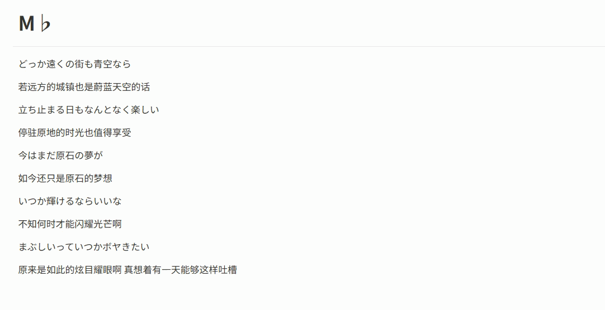
  <br/><br/>
  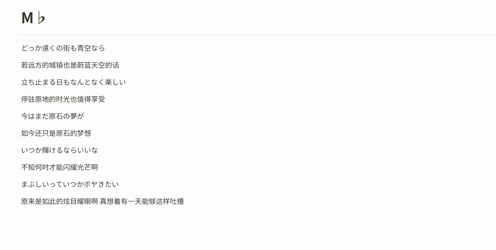
</div>

---

### 3. 🚀 Outer Escape Cancel

- If you change your mind after drawing a gesture, there is no need to drag back to the center core;
- Simply flick outward past the wheel boundary — the wheel enters a translucent safe-cancel state, and releasing the button triggers nothing;
- It can be toggled in settings and fine-tuned with a distance slider (140px ~ 320px); since `v1.6.5`, the outer-escape cancel can also be bound to its own action with common presets, while the center-core cancel can stay silent.

<div align="center">
  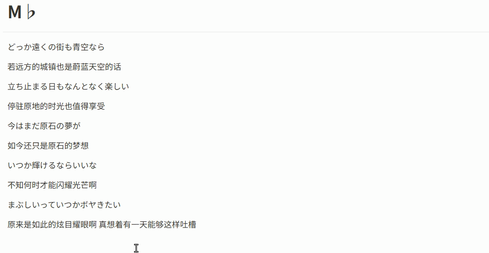
</div>

---

### <a id="visuals"></a>4. 🎨 Multiple Wheel Shapes & Style Presets

- **4 geometric shapes**: Classic Compact Sectors (Original), Floating Circle (Circle), Rounded Capsule (Capsule), and Hexagon Hive;
- **Preset themes**: System Auto, Light, Dark, Liquid Glass, Matcha Forest, Glacial Blue, and Morandi Muted;
- The **live interactive preview canvas** on the right supports zoom, pan, reset, click-to-select, and drag-to-swap with instant feedback; `v1.6.8` adds a screen-edge overflow-protection strategy with X / Y safety margins.

<div align="center">
  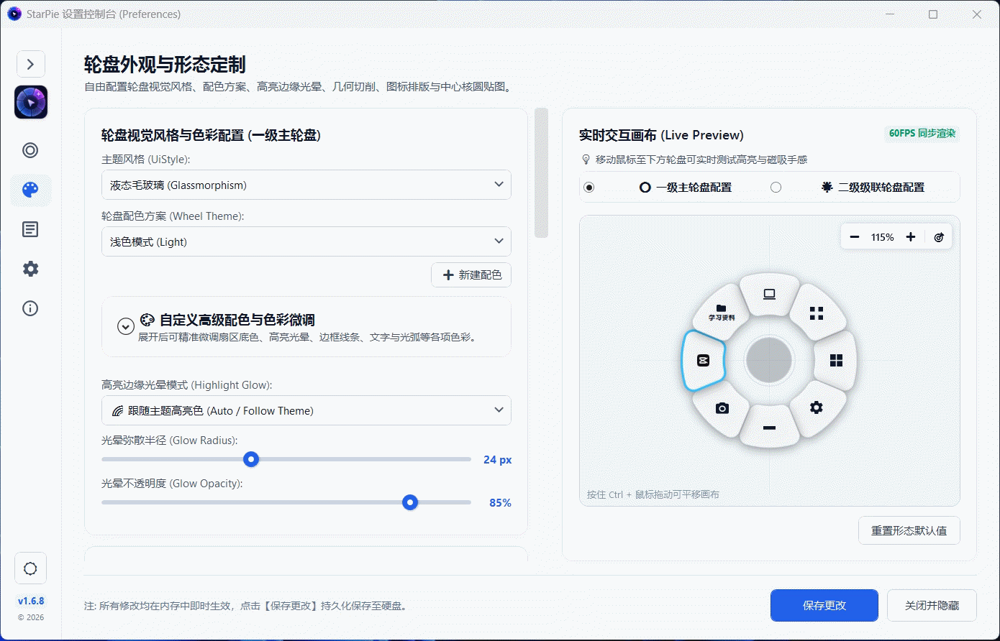
  <br/><br/>
  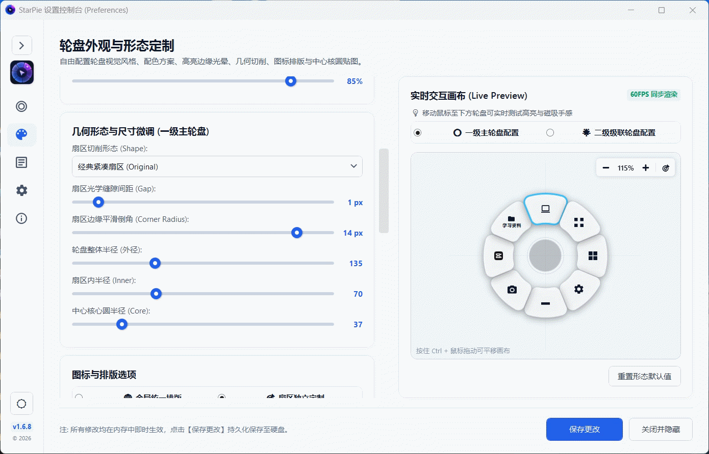
  <br/><br/>
  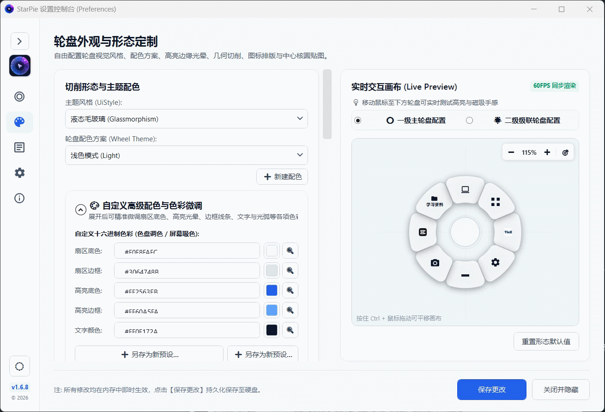
</div>

---

### 5. 🎨 Advanced Color Tuning & Preset Renaming

- An independent collapsible panel for fine-tuning sector background, highlight glow, borders, and text colors;
- Supports hexadecimal color input, palette selection, and on-screen eyedropper;
- Save the current colors as custom presets, with one-click renaming and deletion.

<div align="center">
  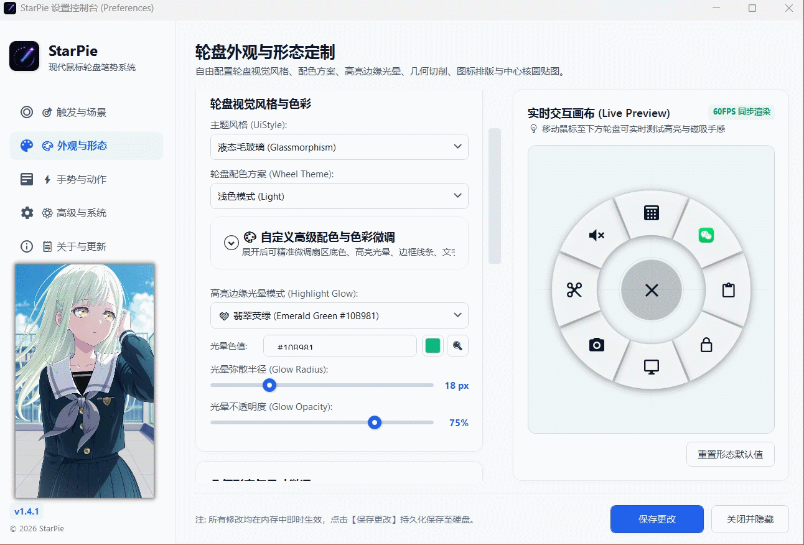
  <br/><br/>
  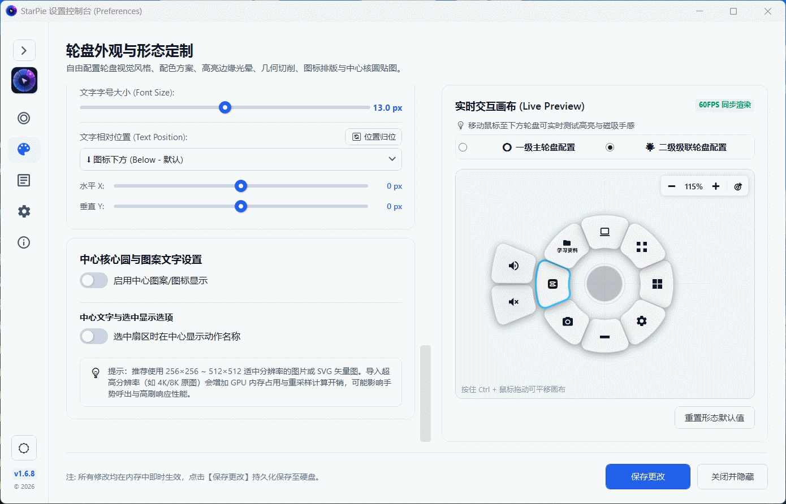
  <br/><br/>
  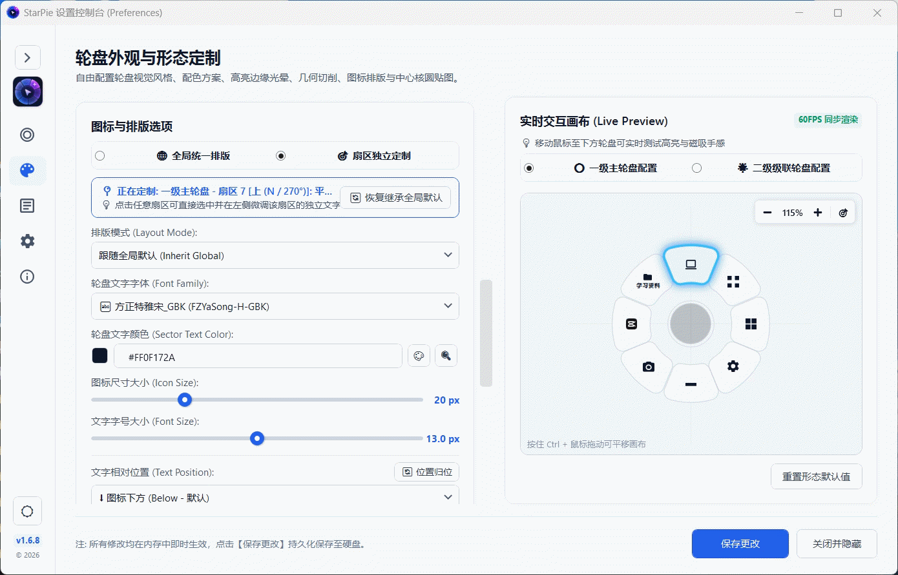
</div>

---

### 6. 🖼️ Custom Vector / Image Icon Import

- The icon library accepts local **SVG vector files** as well as **PNG / ICO / JPG** images;
- Imported icons are stored in the local configuration directory, can be freely used in any sector, and support custom renaming and deletion.

<div align="center">
  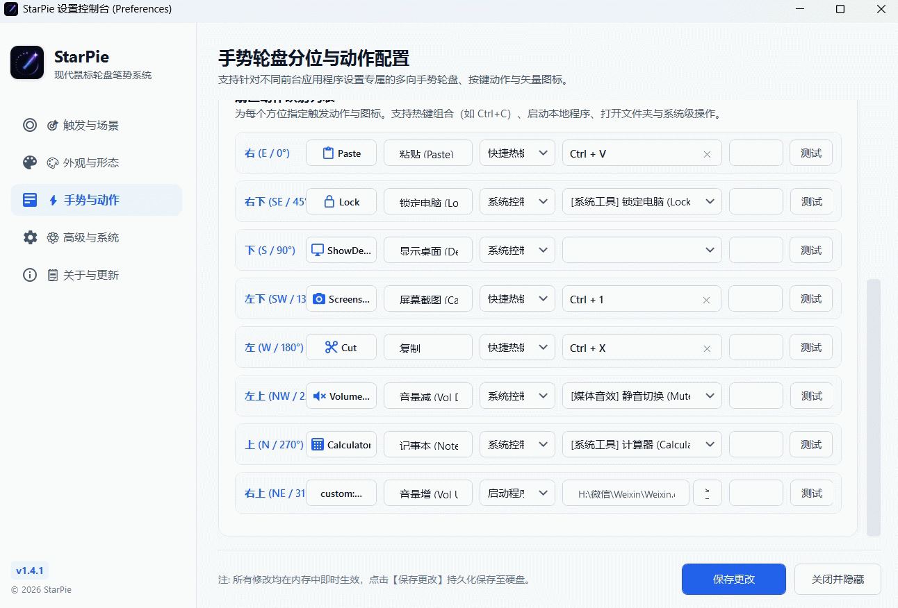
</div>

---

### 7. 🎯 Adaptive 4 / 8 / 12 Sector Layouts

- **4 sectors**: wide cardinal angles, ideal for blind operation;
- **8 sectors**: the classic balanced 8-direction layout (default);
- **12 sectors**: high-density action mapping for multi-action workflows; the center core can also hold its own independent action, with a configurable activation dead-zone sensitivity.

<div align="center">
  
</div>

---

### 8. 💼 Per-App Profiles

- Assign dedicated wheel profiles to different foreground apps such as Chrome, VS Code, Photoshop, or SolidWorks;
- StarPie automatically matches the profile of the currently active app and falls back to the global profile when no dedicated one exists;
- Profiles can be created, duplicated, deleted, and renamed in one click, making it easy to reuse and maintain different workflows.

<div align="center">
  
</div>

---

### 9. 🎛️ Action Configuration Workspace, Quick App Capture & Drag-to-Edit

- The Actions page adopts a two-pane workspace — "profile + focused editing card + live wheel canvas" — while keeping a compact overview list for scanning multiple actions at a glance;
- A smart app selector aggregates installed programs and supports name search and quick filtering;
- A running-window capture tool lets you pick a window or process directly from the current desktop, reducing manual hunting for executable paths;
- Click the canvas to select a target sector, and drag to swap primary sectors, secondary actions, and the center core;
- The center core can enable its own action, with dead-zone release triggering, common presets, and independent text & icon layout;
- Every sector can independently override layout mode, font, font size, text color, icon size, text position, and X / Y offsets.

<div align="center">
   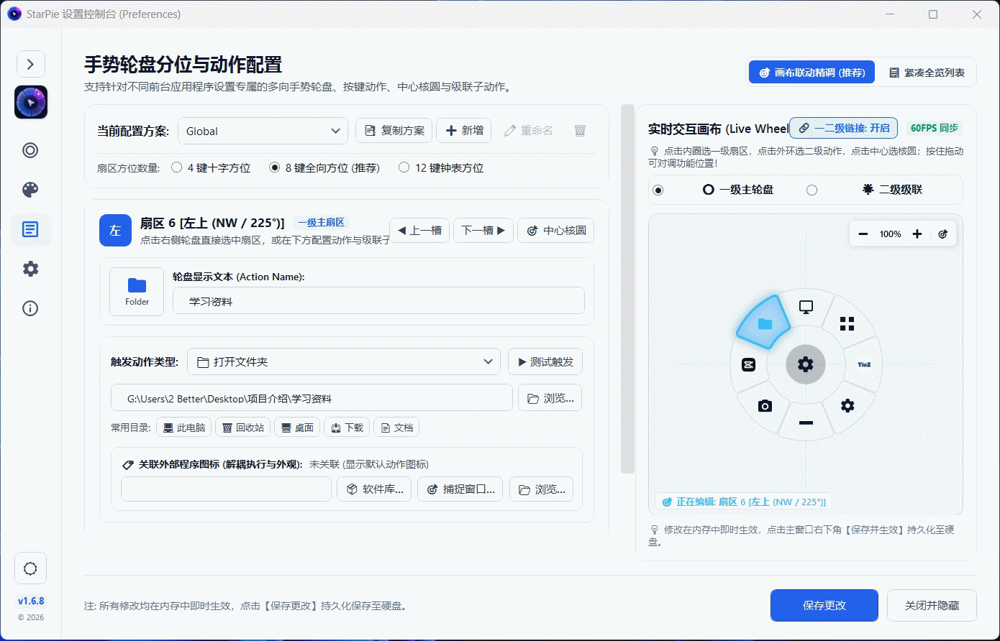
   <br/><br/>
  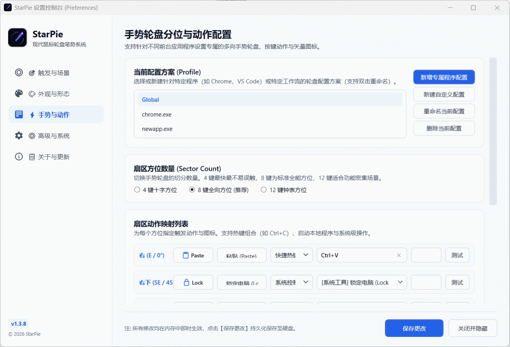
</div>

---

### 10. 🛡️ Scene Isolation, Fullscreen Safety & Multilingual

- **Fullscreen & game detection**: the native right-click is automatically released while fullscreen-exclusive apps or games are running;
- **Modifier passthrough**: bypass the wheel while holding Ctrl / Shift / Alt;
- **Blacklist support**: add specific processes to the exclusion list;
- **Hot language switching**: built-in Simplified Chinese, Traditional Chinese, English, and Japanese, effective instantly; `ScreenHelper` unifies multi-monitor, mixed-DPI, and screen-edge coordinate handling to reduce summoning drift and wheel overflow on secondary displays.

<div align="center">
  
  <br/><br/>
  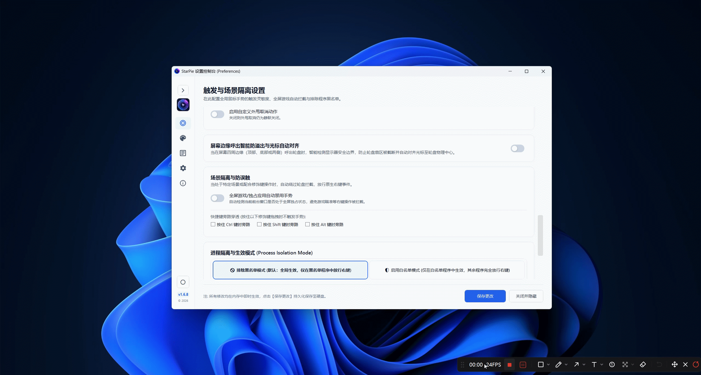
</div>

---

### 11. ➡️ Independent Trail Gestures & Visual Hints

- A dedicated right, middle, or side button can be assigned to trail gestures, running in parallel with the wheel trigger key;
- Supports up to 3 segments and 8 directions, with short-segment filtering and adjacent same-direction merging to reduce micro-jitter misjudgment during fast drawing;
- A transparent trail overlay with start-point and release hints is displayed while drawing; segment sensitivity and hint text placement are adjustable;
- Light clicks below the drag threshold are replayed as native mouse clicks, leaving everyday operation untouched.

<div align="center">

</div>

---

### 12. 🧰 A More Complete Action Type System

| Action Category | Main Use |
| :--- | :--- |
| **Hotkeys** | Record or assemble key combos, with primary-key search, Pause / Break support, and exclusive capture |
| **Launch App** | Start EXEs, shortcuts, or files, with arguments and a normal-privilege launch option |
| **Open URL** | Open with the system default, Chrome, Edge, Firefox, or a custom browser |
| **Open Folder** | Open local paths plus virtual directories like Desktop and Downloads |
| **Run Command** | CMD, PowerShell, WSL, and hidden terminal modes |
| **Screen OCR** | Snip a screen region and call local, AI, or custom HTTP recognition |
| **Window Management** | Switch windows, tile, move across monitors, always-on-top, and transparency control |
| **System Control** | Lock screen, volume, media, Task View, virtual desktops, and other system functions |

Action execution and display icons are fully decoupled — the same action can independently choose a built-in vector icon, the program's icon, or a custom image, no longer constrained by the action type.

---

### 13. 🪟 Window Switching, Management & Tiling Layouts

- **Switch taskbar windows**: bind the Nth running window by the current taskbar order, with icon, title, and activation target all using the same snapshot;
- **Window tiling**: built-in layouts including Left/Right, Top/Bottom, Master-Stack, Grid, Single Window, Horizontal Stack, Vertical Stack, Columns, BSP, and Auto Grid;
- Supports cycling layouts forward / backward, restoring pre-tiling positions, including minimized windows, and a custom process exclusion list;
- Move the currently active window to the next monitor, toggle always-on-top, or adjust window transparency.

<div align="center">
  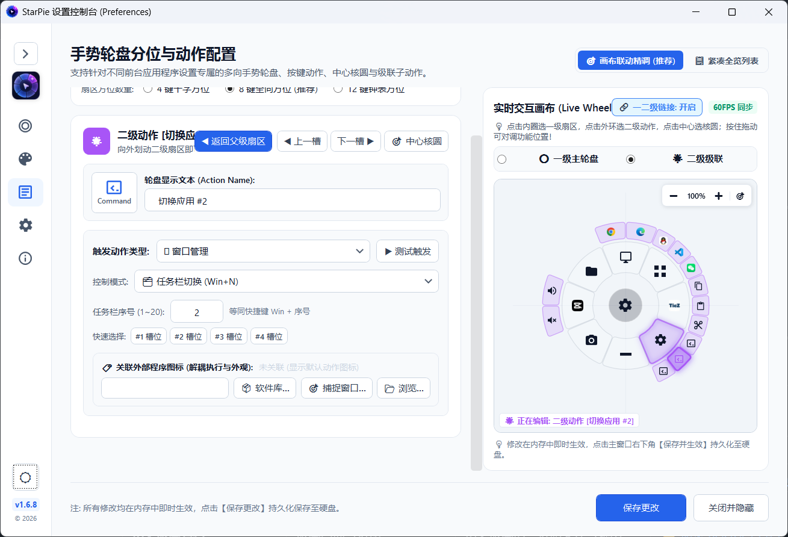
</div>

---

### 14. 📝 Native Windows OCR & Extensible Recognition Interfaces

- Snip any screen region and run text recognition, powered by the native offline `Windows.Media.Ocr` engine on Windows 10 / 11;
- Optional AI vision APIs or custom HTTP OCR services, with language-pack environment diagnostics and a configuration panel;
- Recognition results support auto-copy, a result window, merged lines, CJK spacing handling, and browser search.

<div align="center">
  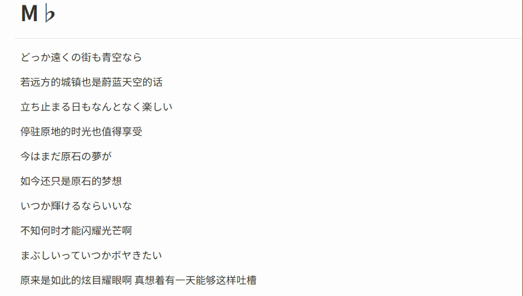
  <br/><br/>
  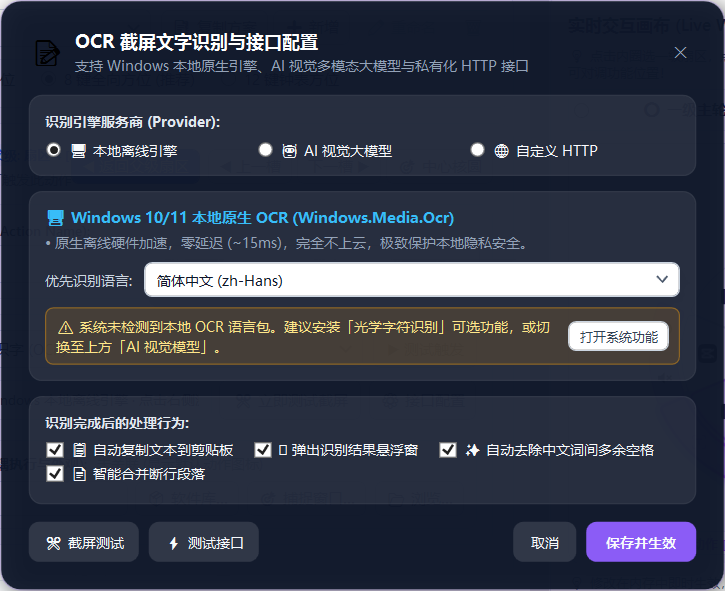
</div>

---

### 15. 🔄 Online Updates, Diagnostic Logs & Contributor Info

- Built-in GitHub Releases update checking with selectable update channels, proxy mirrors, custom proxies, and ignored versions;
- System logs are written asynchronously via a background queue; the log directory and today's log can be opened quickly from settings;
- The contributor card uses an offline roster by default and never connects on startup, only requesting fresh data on manual refresh or update checks.

<div align="center">
  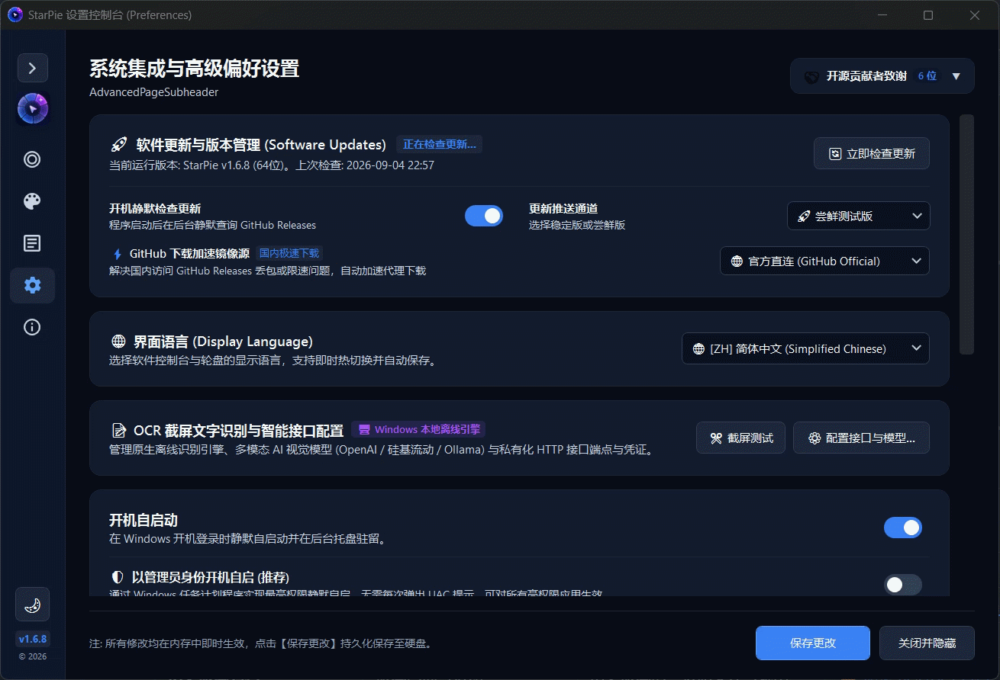
</div>

### 16. 🧩 Plugin System (Community Extensions, In-Process)

- **Official plugins sync online by default**: StarPie fetches the module catalog from the `StarPie-Official-Plugins` GitHub Releases in the background after startup. Missing or outdated official modules are downloaded as `.spkg`, checked against package and assembly SHA-256 values, then installed and enabled.
- **Community plugins remain locally installable**: drop a community plugin `.dll` into the **`plugin` folder next to the executable** and hit "Rescan", then click Install on the candidate card; or pick it via "Install Community Plugin (.dll)" in settings.
- **⚠️ A `.dll` in `plugin\` brings only itself**: other files in the plugin package (icons, resources,
  dependency DLLs) are *not* copied along. For a **full-package install**, use "Install Community Plugin (.dll)" and select
  the `.dll` that sits next to a `plugin.json` — once the manifest is detected the host copies the whole folder.
- **Two directories with separate responsibilities**:

  | Directory | Role |
  | :--- | :--- |
  | `<install dir>\plugin\` | **Community-plugin candidate area**: used only for manual community `.dll` installation. StarPie **never creates, writes or deletes** anything here |
  | `%LOCALAPPDATA%\StarPie\plugin-data\` | **Writable data area**: installed copies, enable state and per-plugin data. Fully removed on uninstall |

- **Install and enable are separate steps**: a freshly installed plugin stays "installed but disabled" until you
  tick it. This keeps "copying a file in" from being equivalent to "letting its code run". The confirmation card
  shows the ID, version, author, target framework, architecture, SHA256, signature status and declared capabilities.
- **Candidate cards state their conclusion outright**: installable / newer version / older version / already
  installed / content changed / duplicate ID / unrecognised. If two files declare the same ID, both are flagged as
  duplicates and neither can be installed.
- **Fail-safe by default**: a single plugin that fails to load or keeps throwing is isolated and never affects the
  host; two consecutive abnormal startups switch on safe mode and temporarily disable the suspect plugins.
- **For plugin authors**: `samples/` contains two reference projects (`HelloAction` as the template,
  `ScreenBrightness` covering P/Invoke, COM and slow I/O). For debugging, run
  `StarPie.exe --plugin-selftest <plugin.dll> [report path] [--skip-invoke]` to exercise the whole chain inside a
  temporary sandbox without touching your installed plugins, or `StarPie.exe --plugin-paths` to inspect the
  effective directories.

---

## <a id="download"></a>🚀 Quick Start & Download

### Current Mainline Release: `v1.6.8`

| Package | Recommended For | Description | Download |
| :--- | :--- | :--- | :--- |
| **Standalone Single-File (Recommended)** | All users | .NET runtime embedded; unzip and run | [⬇️ Download StarPie.exe (Standalone)](https://github.com/oohb144/StarPie-Touch/releases) |
| **Lightweight Portable** | Users with .NET 8 runtime installed | Small footprint, portable | [⬇️ Download StarPie Portable](https://github.com/oohb144/StarPie-Touch/releases) |
| **Touch edition releases** | Version rollbacks & comparison | Binaries and notes for this derivative | [📂 Browse Releases](https://github.com/oohb144/StarPie-Touch/releases) |

### Basic Workflow:
1. Download and run `StarPie.exe` — the app runs quietly in the system tray;
2. Double-click the tray icon or right-click and choose "Preferences", then record the wheel trigger key under "Triggers & Scenes";
3. Hold the trigger key and drag past the threshold, or long-press per your configuration, to summon the wheel near the cursor;
4. Slide onto the target sector and release the trigger key to execute the action; flick outward to cancel or run a custom cancel action;
5. For trail gestures, enable a dedicated gesture trigger key and map 1–3 segment direction combos on the Actions page.

---

## <a id="i18n"></a>🌐 Multilingual Support (Internationalization)

Switch the interface language anytime under "⚙️ Advanced & System" in the settings page:

| Code | Display Name | Status |
| :--- | :--- | :---: |
| `zh-CN` | 🇨🇳 简体中文 (Simplified Chinese) | 🟢 Fully Supported |
| `zh-TW` | 🇭🇰/🇹🇼 繁體中文 (Traditional Chinese) | 🟢 Fully Supported |
| `en` | 🇺🇸 English | 🟢 Fully Supported |
| `ja` | 🇯🇵 日本語 (Japanese) | 🟢 Fully Supported |
| `Auto` | 🖥️ Follow OS Language | 🟢 Fully Supported |

---

## <a id="build"></a>🛠️ Local Build & Development

### Requirements
- Windows 10 / 11 (x64)
- [.NET 8.0 SDK](https://dotnet.microsoft.com/download/dotnet/8.0)
- Python 3.10+ (only needed to run the automated test suite)

### Build & Run
```bash
# 1. Clone the repository
git clone https://github.com/oohb144/StarPie-Touch.git
cd StarPie

# 2. Build the project (Release)
dotnet build WinPieGestures/WinPieGestures.csproj -c Release

# 3. Run the project
dotnet run --project WinPieGestures/WinPieGestures.csproj

# 4. Publish the lightweight build (requires .NET 8 Desktop Runtime on the target machine)
dotnet publish WinPieGestures/WinPieGestures.csproj -c Release -r win-x64 --no-self-contained -o releases/local/Lightweight

# 5. Publish the standalone build (self-contained with .NET runtime)
dotnet publish WinPieGestures/WinPieGestures.csproj -c Release -r win-x64 --self-contained true -p:PublishSingleFile=true -p:IncludeNativeLibrariesForSelfExtract=true -o releases/local/Standalone
```

### Running the Automated Tests (19 GUI cases currently)
```bash
# Install test dependencies
pip install pytest pywinauto

# Run the tests
python -m pytest tests/test_settings.py -v
```

---

## <a id="structure"></a>📂 Project Structure

```text
StarPie/
├── .github/                         # CI workflows & community configs
├── WinPieGestures/                  # Core project (C# / .NET 8 / WPF)
│   ├── ActionExecutor.cs            # Hotkey, app, URL, command & system action dispatching
│   ├── ActionItem.cs                # Action model & per-sector layout overrides
│   ├── MouseHook.cs                 # Win32 low-level mouse hook thread
│   ├── KeyboardHook.cs              # Win32 low-level keyboard hook & exclusive recording
│   ├── GestureController.cs         # Wheel & trail gesture state machine
│   ├── GestureMapping*.cs           # Trail combo mapping & configuration models
│   ├── GestureTrailOverlay.cs       # Trail rendering & release hint overlay
│   ├── RadialWindow.xaml(.cs)       # Transparent wheel window & runtime rendering
│   ├── SettingsWindow.xaml(.cs)     # Two-pane canvas, focused editing & system settings
│   ├── Plugin/                      # Plugin host (load context, scanning, registration, parameter forms, self-test)
│   ├── WindowTaskbarHelper.cs       # Taskbar order, window icons & switching snapshots
│   ├── WindowTiler.cs               # Window tiling, restore, cycling & cross-screen control
│   ├── WindowPickerWindow.xaml(.cs) # Active window & process capture tool
│   ├── ScreenHelper.cs              # Multi-monitor, DPI & screen-edge coordinates
│   ├── ScreenSnipWindow.xaml(.cs)   # OCR snipping region selection
│   ├── OcrManager.cs                # Local, AI & HTTP OCR dispatching
│   ├── OcrSettingsDialog.xaml(.cs)  # OCR engine & interface settings
│   ├── OcrResultWindow.xaml(.cs)    # OCR result display
│   ├── UpdateManager.cs             # GitHub Releases update checking
│   ├── AppLogger.cs                 # Asynchronous runtime logging
│   ├── ConfigManager.cs             # Config persistence, import/export & autostart
│   ├── IconHelper.cs                # Built-in / program / custom icon resolution
│   └── WinPieGestures.csproj        # .NET 8 WPF project configuration
├── StarPie.Plugin.Abstractions/     # Plugin SDK contract (the only StarPie assembly a plugin may reference)
├── samples/                         # Sample plugins (reference template + P/Invoke / COM / slow I/O stress cases)
├── releases/                        # Historical versions & release archive
├── attachments/                     # README screenshots, GIFs & pending demo assets
├── tests/                           # pywinauto GUI automation tests
├── CHANGELOG.md                     # Full version changelog
├── CONTRIBUTING.md                  # Contribution guide
├── LICENSE                          # MIT License
└── README.md                        # Main documentation (Chinese)
```

---

## <a id="acknowledgements"></a>💡 Story & Maintenance

### 🌟 Inspiration

I am a student majoring in Mechanical Design, Manufacturing & Automation. In daily 3D modeling with SolidWorks, I always found its built-in mouse gesture radial menu extremely handy.

After getting to know AI-agent-assisted development tools, the idea came to me of bringing this radial interaction to the entire Windows desktop, hoping to make everyday office work and operation more convenient. For those who have never used a gesture wheel before, this may well be a novel and efficient interaction experience.

Although similar radial-menu projects already exist in the open-source community, each differs in feature focus and interaction details. From the initial idea to the release — interrupted from time to time by coursework and competitions — the current version took about a week of on-and-off collaboration with an AI Agent.

If anything in this project is imperfect or overlooked, thank you for your understanding. Bug reports, usage feedback, and improvement suggestions are always welcome via GitHub Issues!

### 🤖 Human-AI Collaborative Development

This project is led by the developer for architecture design, interaction logic planning, and system tuning, with code construction, multilingual support, interaction optimization, and GUI automation testing co-authored by an AI agent (**AI Agent - Antigravity**) and open-source contributors.

### 📌 Maintenance Notes

- **Current status**: As of 2026-09-04, `main` has been updated to StarPie `v1.6.8`; the wheel, trail gestures, window management, OCR, and configuration workflows are still being continuously refined;
- **Ongoing cadence**: The project continues to be maintained through joint iteration by the developer, community contributors, and AI agents — feature suggestions, compatibility feedback, and demo assets are welcome via Issues / Pull Requests.

---

## <a id="license"></a>📄 License & Usage Terms

This project is licensed under the [MIT License (with Non-Commercial Restriction)](LICENSE):
- **Personal & Non-Commercial Use**: Completely free for personal, educational, research, and non-commercial daily office workflows. Contributions, feature requests, and personal customizations are welcome.
- **Commercial Restrictions**: Without explicit prior written permission from the copyright owner (SoftBlack42), any commercial sale, paid repackaging/distribution on marketplaces, or embedding into proprietary closed-source commercial software is strictly prohibited. For commercial licensing, please contact the author.
