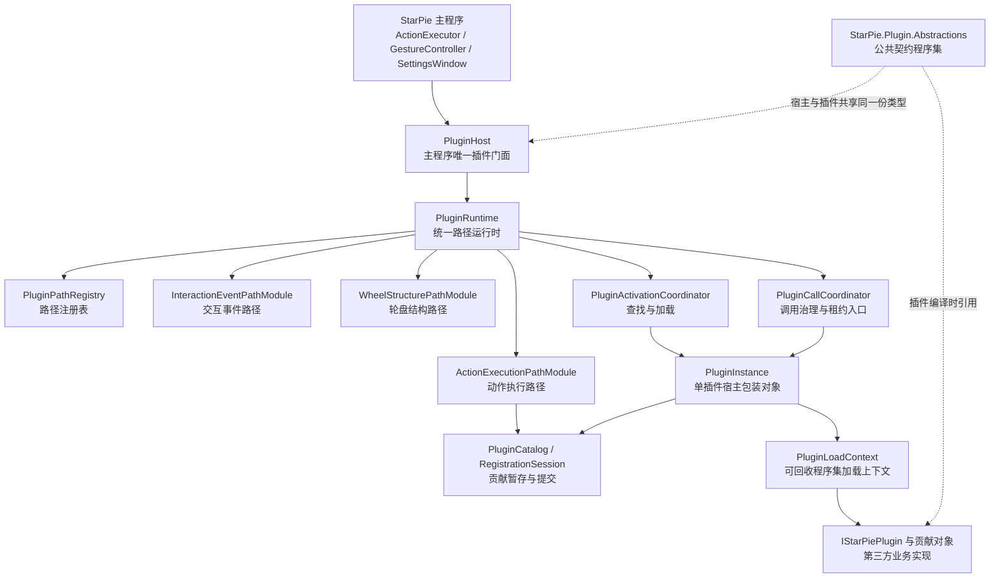
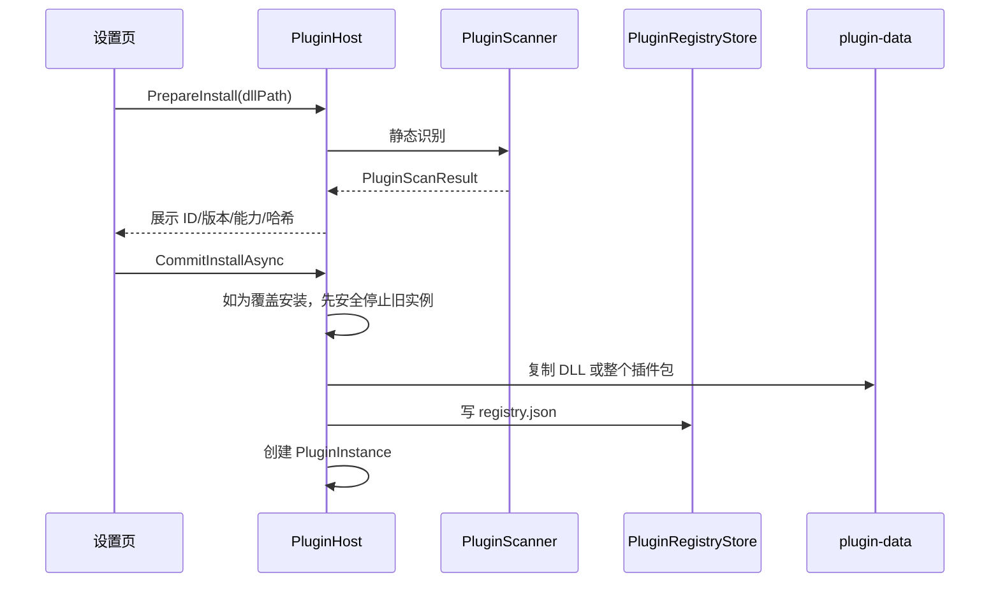
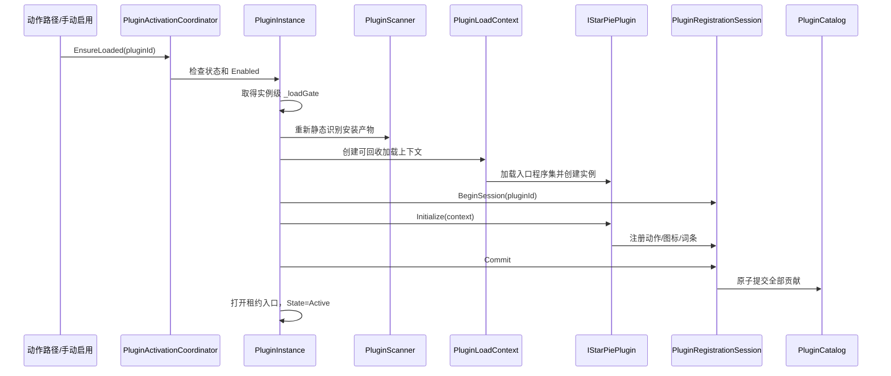
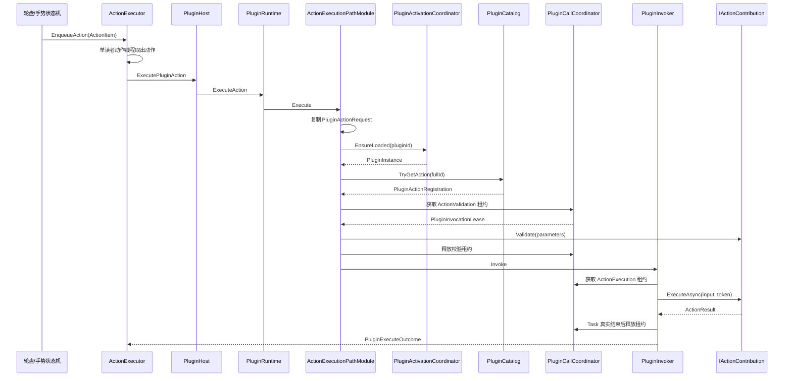
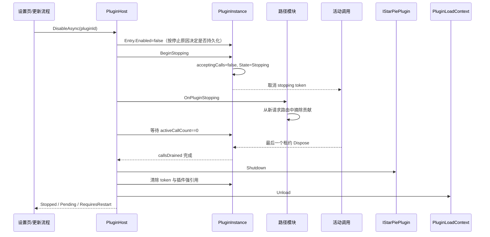

# StarPie 插件系统架构与动作执行路径

> **本分支采用本方案**（2026-09-17 与上游 `dev-plugin` 同步后并入）：本文档描述的是「统一调用运行时 + 路径模块 + 活动调用租约 + 异步停用状态机」重构，即本分支的**现行实现**。此前曾判定它与 `AGENTS.md` §3.7 的顶层类型认领机制在 `PluginHost` 上不可共存，并据此删除了新增模块 `PluginRuntime` / `PluginPathModules`（915 行）；同步上游后确认**二者可以共存** —— `PluginHost` 既经 `PluginRuntime` 登记并分流 `action-execution` / `interaction-event` / `wheel-structure` 三条路径，也经 `PluginActionClaimRegistry` 做顶层类型认领，两个模块已恢复并在用。插件系统的通用规范见 `AGENTS.md` §3.7，运行时重构要点见 §4。
>
> 文档状态：宿主公共基础设施与动作执行路径已基本完成；交互事件路径保留兼容骨架，轮盘结构路径暂为安全占位。
>
> 最后更新：2026-09-17
>
> 适用读者：StarPie 维护者、插件开发者、代码审查者。

---

## 推荐阅读路线

- **第一次了解整个系统**：先读第 1～7 节，再读第 8～18 节的完整流程。
- **只想开发插件**：重点读第 4、10、11、12、13、21 节。
- **维护宿主运行时**：重点读第 5～18、22、23 节。
- **准备扩展新路径**：重点读第 6、14、15、19、20 节。

本文先用通俗语言解释职责，再给出调用顺序和关键类。阅读时不要求先理解 ALC、租约或原子注册，这些概念会在对应流程中逐步说明。

---

## 1. 这套插件系统解决什么问题

StarPie 是一个常驻 Windows 后台的鼠标轮盘程序。插件系统需要允许第三方扩展功能，同时保证：

- 没安装插件的用户几乎不承担额外启动和内存成本；
- 插件不能直接依赖主程序内部类型；
- 一个插件失败不能拖垮轮盘、输入钩子或设置窗口；
- 插件可以被启用、停用、更新和卸载；
- 插件有后台任务时，宿主不能提前调用 `Shutdown` 或卸载程序集；
- 后续可以增加新的调用路径，而不复制整套加载、停止和健康度管理代码。

最核心的设计可以概括为：

```text
插件只实现接口和业务逻辑
        ↓
宿主为每个插件建立 PluginInstance 包装对象
        ↓
路径模块负责“调用什么”
公共运行时负责“能否调用、怎样安全调用、何时释放”
```

---

## 2. 先认识几个关键概念

| 概念 | 通俗解释 |
|---|---|
| 插件入口 | 插件程序集里实现 `IStarPiePlugin` 的类，只负责初始化注册和最终清理 |
| 贡献点 | 插件注册给宿主的具体能力，例如一个动作、一个事件订阅或一个结构提供者 |
| 路径 | 宿主调用插件的一种业务模式，例如动作执行、交互事件、轮盘结构查询 |
| `PluginInstance` | 宿主为单个插件创建的包装对象，管理加载、状态、租约、停止和卸载 |
| Catalog | 宿主保存已成功提交贡献点的运行时目录 |
| 注册会话 | 插件 `Initialize` 期间的暂存区，初始化成功后一次性提交 |
| 租约 | 宿主调用插件代码时自动创建的“正在使用”凭证 |
| ALC | .NET `AssemblyLoadContext`，用于隔离并尝试卸载插件程序集 |
| 惰性加载 | 插件已启用，但只有第一次真正需要时才加载 DLL 和执行 `Initialize` |

需要特别区分两种“插件实例”：

```text
第三方插件对象
└── IStarPiePlugin 的实现，例如 HelloActionPlugin

宿主包装对象
└── PluginInstance，StarPie 内部用于管理上述插件对象
```

本文提到“实例状态、实例锁、租约计数”时，通常指宿主侧 `PluginInstance`。

---

## 3. 总体分层



### 三层工程边界

#### 1. SDK 契约层

目录：`StarPie.Plugin.Abstractions/`

负责定义：

- 插件入口接口；
- 动作、参数和结果 DTO；
- 注册表接口；
- 日志、设置、通知等宿主服务接口；
- manifest 和元数据模型；
- SDK 版本与稳定常量。

契约层本身不负责扫描、加载和调度插件。

#### 2. 宿主实现层

目录：`WinPieGestures/Plugin/`

负责真正执行：

- 扫描和安装；
- 创建 `PluginInstance`；
- 加载程序集；
- 构造插件上下文；
- 注册贡献；
- 调度动作；
- 维护租约；
- 停用和卸载；
- 日志、健康度与自检。

#### 3. 插件实现层

目录：`samples/` 以及第三方插件项目。

插件只引用 SDK，实现业务接口，不引用 `StarPie.dll`。

---

## 4. 为什么需要 `StarPie.Plugin.Abstractions`

宿主和插件必须共享同一套类型定义，例如：

```csharp
IStarPiePlugin
IActionContribution
PluginActionInput
ActionResult
```

插件项目编译时引用：

```text
StarPie.Plugin.Abstractions.dll
```

运行时必须使用宿主提供的同一份程序集。插件包不能再携带一个私有副本，否则虽然接口名称相同，.NET 也会认为它们来自不同程序集，是两个不同类型。

因此插件工程引用通常设置：

```xml
<ProjectReference Include="...\StarPie.Plugin.Abstractions.csproj">
  <Private>false</Private>
</ProjectReference>
```

SDK 契约的基本原则是：

- 只包含接口、枚举、DTO、常量和少量纯函数；
- 不引用 `StarPie.dll`；
- 不依赖 WPF 控件和宿主内部模型；
- 同一主版本内只增不改；
- 破坏性变化需要提升协议主版本。

---

## 5. `PluginHost`：主程序唯一插件入口

文件：`WinPieGestures/Plugin/PluginHost.cs`

`PluginHost` 是 StarPie 其他模块唯一需要认识的插件类型。

主程序通过它完成：

```text
初始化插件系统
安装 / 启用 / 停用 / 更新 / 卸载
查询已注册动作
执行插件动作
广播交互事件
查询轮盘结构
```

例如动作执行入口只有：

```csharp
PluginHost.ExecutePluginAction(action);
```

`ActionExecutor` 不需要知道：

- DLL 如何加载；
- 插件入口对象是什么类型；
- 租约如何管理；
- Catalog 如何查询；
- ALC 如何卸载。

这些细节全部隐藏在 `PluginHost` 后面。

`PluginHost` 还是进程级插件实例表的所有者：

```text
Instances[pluginId] → PluginInstance
```

字典根据插件 ID 找到包装实例，但锁本身不单独保存在锁字典中。每个 `PluginInstance` 自己持有自己的状态锁和加载锁。

---

## 6. `PluginRuntime`：路径和公共设施的组合根

文件：`WinPieGestures/Plugin/PluginRuntime.cs`

`PluginRuntime` 将公共能力和具体路径组装起来：

```text
PluginRuntime
├── PluginPathRegistry
├── PluginActivationCoordinator
├── PluginCallCoordinator
├── ActionExecutionPathModule
├── InteractionEventPathModule
└── WheelStructurePathModule
```

### `PluginPathRegistry`

负责登记宿主支持的路径：

```text
action-execution
interaction-event
wheel-structure
```

路径公共接口只统一：

- 稳定路径 ID；
- 插件开始停止通知；
- 插件已经停止通知。

它不会把三种路径强行压成：

```csharp
Invoke(string path, object payload)
```

动作、事件和结构仍然保留各自的强类型请求和结果。

### `PluginActivationCoordinator`

负责“怎样加载插件”，包括：

- 根据 ID 找到 `PluginInstance`；
- 检查插件系统总开关；
- 检查安装、启用、隔离和不兼容状态；
- 拒绝正在停止或需要重启的实例；
- 合并同一个插件的并发加载；
- 调用 `PluginInstance.Load`；
- 返回统一激活结果。

它不会擅自修改用户的 `Entry.Enabled` 偏好。

是否触发加载由路径决定：

| 路径 | 加载策略 |
|---|---|
| 动作执行 | 已启用但未加载时允许惰性加载 |
| 交互事件 | 广播时不加载插件，只通知已有订阅者 |
| 轮盘结构 | 未来按明确 Provider 引用有条件加载 |

### `PluginCallCoordinator`

负责进入插件代码前的公共治理入口：

- 获取活动调用租约；
- 拒绝已经停止的插件；
- 统一捕获路径入口异常；
- 给每次调用标注 `PluginCallKind`。

具体业务结果仍由各路径解释。

---

## 7. `PluginInstance`：宿主侧插件包装对象

文件：`WinPieGestures/Plugin/PluginInstance.cs`

这是整个系统中最关键的对象之一。

一个 `PluginInstance` 对应一个插件 ID，并持有：

```text
PluginId
PluginRegistryEntry
PluginScanResult
PluginLoadContext
IStarPiePlugin 插件入口对象
PluginContext
PluginRegistrationSession
注册 token
插件事件服务
日志和私有设置
运行状态
加载与卸载锁
活动调用租约计数
停止取消源
ALC 弱引用探针
```

它解决的问题是：插件对象本身只知道 `Initialize` 和 `Shutdown`，而宿主还需要知道：

- 插件是否安装；
- 是否已启用；
- 是否已加载；
- 是否正在停止；
- 当前有多少调用；
- 是否允许新调用；
- 是否被隔离；
- ALC 是否真正释放；
- 是否需要重启。

### 运行状态

```text
Installed
→ Loading
→ Active
→ Stopping
→ Installed
```

异常状态包括：

```text
Faulted
Quarantined
Failed
Incompatible
RequiresRestart
```

`Active` 且活动租约为 0 是插件最常见的空闲状态。租约归零不会自动卸载插件；只有进入 `Stopping` 后，租约归零才允许继续 `Shutdown`。

---

## 8. 插件发现和安装过程

### 两个插件目录

| 目录 | 用途 |
|---|---|
| `<程序目录>\plugin\` | 只读候选来源区，宿主不创建、不修改、不删除 |
| `%LOCALAPPDATA%\StarPie\plugin-data\` | 可写宿主区，保存安装副本、登记、数据和设置 |

便携模式只改变可写宿主区位置，不改变只读扫描目录。

### 静态扫描

入口类：`PluginScanner`

扫描阶段只读取 PE 和程序集元数据，不执行插件代码，主要检查：

- 文件是否为 .NET 程序集；
- 目标框架是否高于宿主；
- CPU 架构是否兼容；
- 是否存在插件入口；
- 是否携带私有 `StarPie.Plugin.Abstractions.dll`；
- manifest 与程序集信息是否一致。

### 安装过程



安装和启用是两个动作。普通安装默认只登记文件，不执行插件代码。

---

## 8.1 官方在线模块、类型认领与宿主能力

### 内建动作的最终分工

`Hotkey` 是唯一保留在 `BuiltinActionCatalog` 的内建动作。它也是未配置槽位的占位类型，不能外移；否则用户停用某个动作包后，空槽位也会变成“动作不可用”。

其余 12 个原内建动作以 `StarPie-Official-Plugins` 仓库中的单动作模块独立发布，并由主程序从官方 catalog 下载：

```text
Launch / WebUrl / Folder / Command / ShellTool
Tile / ToggleTopmost / MoveMonitor / WindowOpacity / SwitchWindow
Ocr / System
```

单动作包的拆分粒度就是用户可以停用的粒度。插件工程只依赖 `StarPie.Plugin.Abstractions`，并以 `Private=false` 引用它；主工程不引用插件类型，也不再构建或随发行包复制官方模块 DLL。

### 顶层类型认领（Type Claim）

旧配置以 `ActionItem.Type` 保存动作身份，例如 `Launch`、`Url` 或 `Tile`。为了保留旧动作类型的持久化形态，官方在线模块通过程序集静态元数据声明：

```text
StarPiePluginTypeClaims = "Launch=launch"
```

`PluginActionClaimRegistry` 只读取登记表中的官方模块认领快照，将顶层类型解析为 `PluginId + ContributionId`。它不加载 DLL、不执行插件代码，也不承担参数校验或调度。

动作派发顺序是固定契约：

```text
ActionExecutor
  1. BuiltinActionCatalog（Hotkey）
  2. PluginActionClaimRegistry（旧 Type → 官方在线模块贡献点，唯一所有者）
  3. Type="Plugin" 普通社区插件动作

已完成官方插件交割的旧 Type 不再进入历史 switch；未迁移的遗留类型仍按主程序兼容逻辑处理。
```

认领规则：

- 只有登记为 `Official` 的官方在线模块可以认领顶层类型；
- 不能认领 `Plugin` 或仍在内建目录中的类型；
- 多个官方模块争抢同一类型时整组拒绝，绝不采用后写覆盖；
- 已认领贡献点不显示在普通“插件动作”子下拉中，避免同一功能出现两种互不兼容的持久化形态；
- 认领动作的旧裸字段由 `ActionParameterProjection` 投影为参数字典，再进入 `PluginRuntime.Actions` 的统一激活、校验、租约和调用路径。

### 官方在线模块同步

宿主启动时只读取本地已登记插件，不自动联网同步官方模块。用户在插件管理页手动刷新 catalog 并安装指定模块：

```text
用户点击安装
  → 手动获取官方 Release catalog
  → 下载用户选定的 .spkg
  → 校验包大小、包 SHA-256、module.manifest.json 与程序集 SHA-256
  → 安装到 plugin-data 并标记 Official
  → 启用模块并重建 PluginActionClaimRegistry
```

网络请求、下载和解压只在用户明确点击刷新或安装时执行，绝不进入启动、鼠标钩子或手势动作热路径。网络失败不会影响本地已安装模块；社区插件候选区 `程序目录\plugin` 仅保留给手动安装社区 DLL。

### SDK 1.4 能力门禁

`IPluginContext` 还提供以下宿主能力面：

| 服务 | 执行所需能力 |
|---|---|
| `Commands` / `Shell` | `Process` |
| `Windows` | `WindowControl` |
| `ScreenCapture` | `ScreenCapture` |
| `System` | `InputSimulation` |

能力检查发生在会产生实际后果的宿主服务调用点；用于构建参数表单的终端、布局和预设列表仍可读取。`PluginCapabilityLabels` 是安装确认页能力文案的唯一来源，自检会检查每个能力位均有说明。

---

## 9. 插件启用和加载过程

### 为什么要惰性加载

插件已启用不等于已经加载：

```text
Entry.Enabled = true
IsLoaded = false
```

这种状态允许 StarPie 启动时只进行静态扫描，等用户第一次真正使用插件动作时再加载程序集，降低后台内存和启动开销。

### 加载顺序



### 加载锁

每个 `PluginInstance` 自己持有 `_loadGate`。

它保证同一个插件不会同时执行：

```text
Load + Load
Load + Unload
Unload + Unload
```

不同插件拥有不同的 `_loadGate`，因此可以独立加载。

加载锁内还会再次检查 `Entry.Enabled`，避免动作线程准备惰性加载时，用户已经点击停用却又把插件重新拉起。

---

## 10. 插件如何注册具体行为

插件入口只负责注册贡献，不承载所有业务方法。

示例：

```csharp
public sealed class HelloActionPlugin : IStarPiePlugin
{
    public void Initialize(IPluginContext context)
    {
        context.Actions.Register(new GreetContribution(context));
        context.Actions.Register(new OpenFolderContribution(context));
    }

    public void Shutdown()
    {
    }
}
```

一个动作实现 `IActionContribution`：

```csharp
public interface IActionContribution
{
    ActionDescriptor Descriptor { get; }
    IReadOnlyList<ParameterField> Parameters { get; }
    string? Validate(IReadOnlyDictionary<string, string> parameters);
    string Preview(IReadOnlyDictionary<string, string> parameters);
    Task<ActionResult> ExecuteAsync(
        PluginActionInput input,
        CancellationToken cancellationToken);
}
```

### 注册不是立即生效

```text
context.Actions.Register
→ PluginActionRegistry 校验
→ PluginRegistrationSession.StageAction
→ Initialize 成功
→ PluginCatalog.Commit
```

如果 `Initialize` 中途失败，整个注册会话被丢弃，不会留下“动作注册了但图标和词条没注册”的半残状态。

### 完整 ID

插件声明短 ID：

```text
greet
```

插件 ID：

```text
com.example.hello
```

宿主生成：

```text
com.example.hello.greet
```

配置分别保存 `PluginId` 和 `ContributionId`，不保存方法名、类型名或委托。

---

## 11. `PluginContext`：插件能够使用的宿主能力

宿主调用 `Initialize` 时注入 `IPluginContext`。

插件可以使用：

```text
Me               插件自己的元数据
PluginDirectory  只读安装目录
DataDirectory    私有可写数据目录
Log              插件专属日志
Settings         插件私有配置
Actions          动作注册表
I18n             多语言注册表
Icons            图标注册表
Host             已验证的宿主动作能力
Info             宿主环境信息
Notify           非阻塞通知
Events           旧版宿主事件订阅
Dispatcher       UI 线程调度门面
```

插件拿不到 `AppConfig`、`ActionExecutor`、`SettingsWindow` 等具体宿主类型，因此主程序内部可以继续重构而不破坏插件接口。

---

## 12. 动作执行路径的完整调用过程

动作路径目前是三条路径中完成度最高的一条。

### 总流程



### `ActionExecutor`

文件：`WinPieGestures/ActionExecutor.cs`

所有动作先进入一个单读者 `Channel<ActionItem>`。这保证内置 Sequential 动作和插件 Sequential 动作按顺序进入动作线程。

插件分支只调用 `PluginHost`，不会直接接触插件对象。

### `PluginActionRequest`

文件：`WinPieGestures/Plugin/PluginPathModules.cs`

动作进入路径时立即复制为不可变请求：

```text
PluginId
ContributionId
FullId
ActionName
只读参数快照
```

之后即使设置页修改原始 `ActionItem`，当前调用也不会被改变。

### `ActionExecutionPathModule`

负责动作特有语义：

1. 创建请求快照；
2. 触发公用激活；
3. 按 `FullId` 查询贡献；
4. 执行声明式参数校验；
5. 调用插件自定义 `Validate`；
6. 交给 `PluginInvoker` 调度；
7. 将结果转换成 `PluginExecuteOutcome`。

设置页参数校验复用相同实现，但不会为了显示错误而自动加载插件。

---

## 13. `PluginInvoker`：Sequential 和 Background 调度

文件：`WinPieGestures/Plugin/PluginInvoker.cs`

### Sequential

适合：

- 快捷键；
- 文本输入；
- 前台窗口；
- 剪贴板；
- 短小且需要顺序的操作。

流程：

```text
取得 ActionExecution 租约
→ 在动作线程调用 ExecuteAsync
→ 同步等待结果或超时
→ 解释 ActionResult
→ 真实结束后释放租约
```

### Background

适合：

- 网络请求；
- 文件 IO；
- COM；
- DDC/CI；
- 长时间计算。

流程：

```text
动作线程先取得租约
→ 投递 Task.Run
→ 立即返回“已在后台执行”
→ 后台闭包持有租约
→ ExecuteAsync 真实结束
→ finally 释放租约
```

“已排队”不等于“已完成”，所以不能在返回 `QueuedToBackground` 时释放租约。

### 超时

```text
宿主报告超时
≠
插件 Task 已经结束
```

如果任务超时后仍运行，宿主把租约交给后台观察逻辑，直到 Task 最终结束才释放。这样停用插件时不会误以为插件已经空闲。

---

## 14. 活动调用租约

租约是宿主内部的一次性使用凭证，插件作者看不到也不手动管理。

`PluginInstance` 保存：

```text
_acceptingCalls   是否接受新调用
_activeCallCount  当前活动调用数
_stoppingCts      插件停止取消信号
_callsDrained     调用归零通知
```

### 取得租约

```csharp
lock (_gate)
{
    if (!_acceptingCalls)
        return false;

    _activeCallCount++;
    return new PluginInvocationLease(this, kind, stoppingToken);
}
```

### 释放租约

```csharp
lease.Dispose();
```

内部执行：

```text
PluginInvocationLease.Dispose
→ PluginInstance.ReleaseInvocation
→ activeCallCount - 1
→ 如果已经 Stopping 且计数为 0，唤醒停用流程
```

### 为什么不依赖 GC

租约通过 `finally` 或 `using` 确定性释放，不等待垃圾回收器。GC 只负责内存，不能表达“插件任务是否真正结束”。

### 当前覆盖的插件回调

- 动作 `Validate`；
- 动作 `Preview`；
- 动作 `ExecuteAsync`；
- `OnLanguageChanged`；
- 旧版 `OnWheelOpening`；
- 旧版 `OnWheelClosed`。

未来事件贡献和结构查询也必须复用同一机制。

---

## 15. 异步停用过程

入口：`PluginHost.DisableAsync`



### 默认 5 秒宽限时间

如果调用在 5 秒内结束：

```text
Stopped
```

如果调用仍未结束：

```text
Pending
```

此时：

- UI 不再阻塞；
- 插件拒绝新调用；
- 宿主继续后台等待；
- 不调用 `Shutdown`；
- 不强制卸载 ALC。

任务稍后结束后，后台停用流程自动继续。

### 不同停止原因

| 原因 | 是否清除插件自身 Enabled 偏好 | 后续要求 |
|---|---:|---|
| 用户停用 | 是 | 可以返回 Pending |
| 热重载 | 临时关闭，成功后重新启用 | 必须完全停止后才加载新实例 |
| 更新/覆盖安装 | 是，随后由新安装结果决定 | 必须完全停止后才覆盖文件 |
| 卸载 | 是 | 必须完全停止后才删除目录 |
| 插件系统总开关 | 否 | 只停止当前运行时 |
| 应用退出 | 否 | 保留下次启动的启用偏好 |

同一插件的并发停用请求会合并到同一个后台停止任务，避免重复调用 `Shutdown` 或重复卸载。

---

## 16. 热重载、更新和卸载为何必须等待

### 热重载

```text
DisableAsync(Reload)
→ 确认旧运行时完全停止
→ Enable
```

如果旧任务未结束，不允许加载第二个插件版本。

### 覆盖安装

```text
CommitInstallAsync
→ 安全停止旧实例
→ 确认 ALC 释放
→ 覆盖 DLL 和清单
→ 创建新 PluginInstance
```

如果停止结果是 `Pending` 或 `RequiresRestart`，覆盖安装失败并给出明确说明。

### 卸载

```text
UninstallAsync
→ 安全停止
→ 删除宿主拥有的安装目录
→ 删除 registry 记录
→ 从 Instances 移除包装对象
```

外部开发路径只删除登记，不删除开发者文件。

---

## 17. 三种锁和它们各自保护什么

### `PluginHost.Gate`

进程级短锁，主要保护：

- `Instances` 字典；
- 插件集合的增删和快照。

不应在持有它时调用插件代码或等待长任务。

### `PluginInstance._loadGate`

每插件独立，保护：

```text
Load
EnsureLoaded
Unload
```

防止同一插件重复加载或加载与卸载同时发生。

### `PluginInstance._gate`

每插件独立的短状态锁，保护：

- `State`；
- `_acceptingCalls`；
- `_activeCallCount`；
- `_stoppingCts`；
- `_callsDrained`。

只做快速状态读写，不在这把锁内调用插件、执行 IO 或等待 Task。

---

## 18. 错误隔离、健康度和熔断

`PluginInvoker` 捕获插件异常，不让异常进入：

- `ActionExecutor`；
- WPF 消息循环；
- 轮盘状态机；
- 输入钩子线程。

当前健康度包括：

```text
调用次数
失败次数
平均耗时
连续失败次数
窗口失败次数
最后错误
是否需要重启
```

连续失败达到阈值后：

```text
Active
→ Faulted
→ Quarantined
```

被隔离插件拒绝新调用，并将启用状态关闭。

因插件停用导致的取消不计入插件故障；环境不具备条件也不应被错误计为插件缺陷。

---

## 19. 交互事件路径当前状态

文件：`WinPieGestures/Plugin/PluginPathModules.cs`

当前已经具备：

- `InteractionEventPathModule`；
- 路径生命周期；
- 旧版 Opening/Closed 订阅；
- 语言事件订阅；
- 回调租约；
- 停用时撤销订阅；
- 统一事件信封占位。

尚未完成：

- 正式 `IInteractionContribution`；
- 每插件有界队列；
- `SessionId` 和 `Sequence`；
- 高频事件合并；
- 背压；
- 真实轮盘状态机语义事件接入。

交互事件路径的原则是只观察，不修改当前选择、结构和导航结果。

---

## 20. 轮盘结构路径当前状态

当前只有：

- `WheelStructurePathModule`；
- `PluginWheelStructureRequest`；
- `PluginWheelStructureSnapshot.Empty`；
- 路径入口和安全回退。

尚未开放第三方结构提供者。

未来插件只提供声明式节点快照，StarPie 继续负责：

- 布局；
- 渲染；
- 命中测试；
- 动画；
- 导航；
- 最终动作执行。

不会向插件暴露 `WheelProfile`、`ActionItem`、`RadialWindow` 或 WPF 控件。

---

## 21. 插件开发者实际需要做什么

最小插件仍然很简单：

```csharp
public sealed class MyPlugin : IStarPiePlugin
{
    private IPluginContext? _context;

    public void Initialize(IPluginContext context)
    {
        _context = context;
        context.Actions.Register(new MyAction(context));
    }

    public void Shutdown()
    {
        _context = null;
    }
}
```

动作：

```csharp
public async Task<ActionResult> ExecuteAsync(
    PluginActionInput input,
    CancellationToken cancellationToken)
{
    await DoWorkAsync(cancellationToken);
    return ActionResult.Ok();
}
```

插件作者不需要：

- 取得或释放租约；
- 维护活动调用计数；
- 管理 ALC；
- 调用 `DisableAsync`；
- 报告任务结束；
- 处理宿主的 `Stopping` 状态。

但 `ExecuteAsync` 返回的 Task 必须代表真实工作的完整生命周期。不要在里面启动一个未等待的长期 Task 后立刻返回成功，否则宿主会认为本次调用已经结束。

---

## 22. 当前完成度

### 公共宿主基础设施

已基本完成：

- 静态扫描；
- 安装目录治理；
- ALC 加载；
- `PluginInstance` 包装；
- 原子注册；
- 路径注册表；
- 激活协调器；
- 活动调用租约；
- `Stopping` 门禁；
- 异步停用；
- 热重载/更新/卸载安全等待；
- 健康度和隔离；
- 端到端自检。

### 动作执行路径

已基本完成：

- 不可变请求；
- 惰性加载；
- FullId 查询；
- 两层参数校验；
- Preview/Validate/Execute 租约；
- Sequential/Background 调度；
- 超时后继续追踪真实 Task；
- 停用取消；
- 结果和基础健康度。

后续增强项：

- 更细的结果分类；
- 每插件和每动作并发策略；
- 更完整的跨路径健康度统计；
- 更多真实插件压力测试。

### 其他路径

- 交互事件：兼容骨架已存在，正式事件队列未完成；
- 轮盘结构：安全占位已存在，第三方契约未开放。

---

## 23. 关键类速查

| 类 | 主要作用 |
|---|---|
| `PluginHost` | 主程序唯一门面，管理安装、启停、更新、卸载和路径入口 |
| `PluginRuntime` | 组合公共协调器和路径模块 |
| `PluginPathRegistry` | 登记宿主支持的路径并广播停止生命周期 |
| `PluginActivationCoordinator` | 根据 ID 查找实例、检查状态并确保完成加载 |
| `PluginCallCoordinator` | 进入插件代码前取得租约并提供统一异常治理入口 |
| `PluginInstance` | 单个插件的宿主包装对象，管理状态、锁、租约、ALC 和插件入口 |
| `PluginInvocationLease` | 一次插件回调的活动使用凭证 |
| `PluginScanner` | 不执行代码地识别 DLL、TFM、架构和入口 |
| `PluginManifestReader` | 读取 plugin.json 或程序集元数据 |
| `PluginLoadContext` | 隔离并尝试卸载插件程序集 |
| `PluginCatalog` | 保存已经成功提交的动作、图标和词条 |
| `PluginRegistrationSession` | Initialize 阶段的贡献暂存区 |
| `PluginContext` | `IPluginContext` 的宿主实现，向插件提供服务接口 |
| `ActionExecutionPathModule` | 动作请求、激活、查询、校验和调用的路径语义 |
| `PluginInvoker` | Sequential/Background、超时、结果和健康度 |
| `InteractionEventPathModule` | 当前旧事件订阅与未来统一事件路径 |
| `WheelStructurePathModule` | 未来声明式轮盘结构路径，目前为空实现 |
| `PluginSelfTest` | 临时沙箱中的端到端识别、安装、调用、租约、停用和卸载测试 |

---

## 24. 相关源码入口

```text
StarPie.Plugin.Abstractions/
├── IStarPiePlugin.cs
├── IPluginContext.cs
├── Actions.cs
├── Registries.cs
├── Services.cs
├── PluginManifest.cs
├── PluginMetadata.cs
└── PluginApi.cs

WinPieGestures/Plugin/
├── PluginHost.cs
├── PluginRuntime.cs
├── PluginPathModules.cs
├── PluginInstance.cs
├── PluginInvoker.cs
├── PluginCatalog.cs
├── PluginContext.cs
├── PluginHostServices.cs
├── PluginLoadContext.cs
├── PluginScanner.cs
├── PluginManifestReader.cs
├── PluginRegistryStore.cs
├── PluginPaths.cs
└── PluginSelfTest.cs
```

建议阅读顺序：

```text
StarPie.Plugin.Abstractions/IStarPiePlugin.cs
→ IPluginContext.cs
→ Actions.cs
→ WinPieGestures/Plugin/PluginHost.cs
→ PluginRuntime.cs
→ PluginInstance.cs
→ PluginCatalog.cs
→ PluginContext.cs
→ PluginPathModules.cs
→ PluginInvoker.cs
→ PluginSelfTest.cs
```
